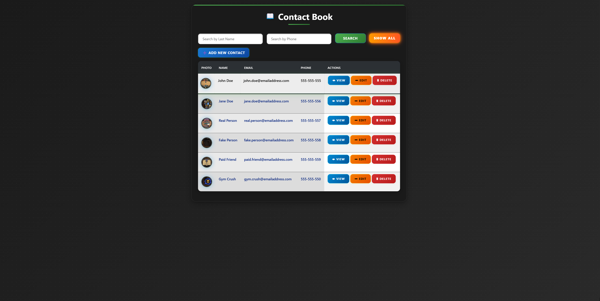
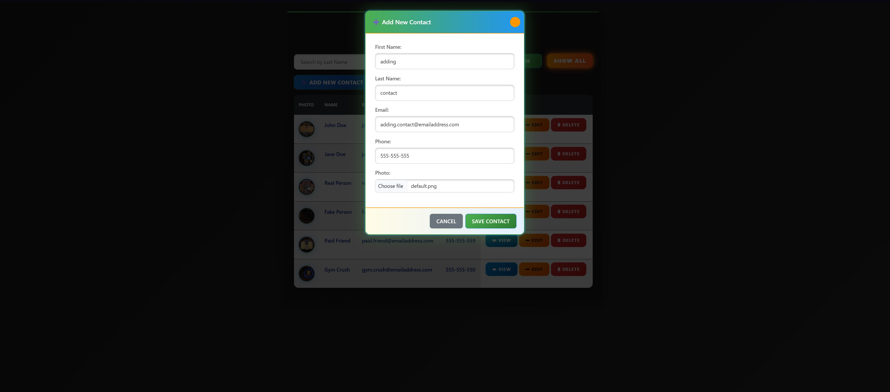
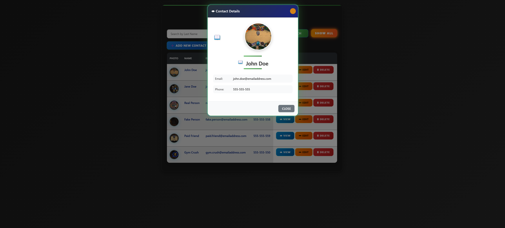
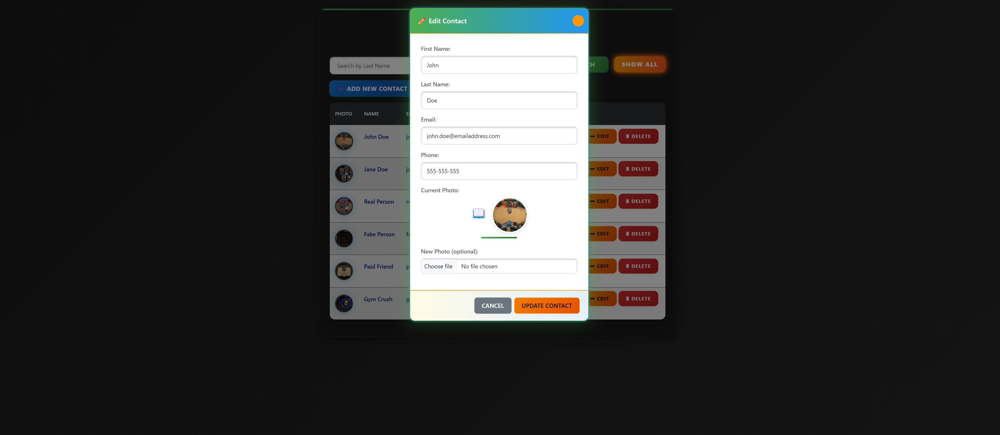

🔒 This project is unlicensed and intended for educational purposes only.

# 📖 Contact Book

A modern, animated, and responsive web-based contact book application. Effortlessly add, search, view, edit, and delete contacts with a beautiful, interactive UI and real-time AJAX updates. No page reloads required! It was created as a student project.

---

## ✨ Features
- **Live search and filtering** of contacts
- **Add, edit, and delete** contacts instantly
- **Profile photo upload** and display
- **Detailed contact view** in stylish modals
- **Flashy, animated UI** with glowing effects and smooth transitions
- **Responsive design** for desktop and mobile
- **AJAX-based operations** for a fast, app-like feel

---

## 🎬 Screenshots

<p align="center><strong>Main</strong></p>



<p align="center><strong>Add</strong></p>



<p align="center><strong>View</strong></p>



<p align="center><strong>Edit</strong></p>



---

## 🛠️ Technologies Used
- **PHP** (backend logic)
- **MySQL** (database)
- **Bootstrap 5** (responsive UI)
- **jQuery** (AJAX and DOM manipulation)
- **Custom CSS** (animations, theming)
- **XAMPP** (local development)

---

## 🚀 Setup Instructions

1. **Clone the repository**
   ```
2. **Set up your local server:**
   - Use [XAMPP] or similar (Apache + MySQL)
   - Place the project folder in your `htdocs` directory
3. **Create the database:**
   - Open phpMyAdmin
   - Create a database named `contact_book`
   - Run the following SQL to create the `contacts` table:
     ```sql
     CREATE TABLE `contacts` (
       `id` INT NOT NULL AUTO_INCREMENT PRIMARY KEY,
       `first_name` VARCHAR(100) NOT NULL,
       `last_name` VARCHAR(100) NOT NULL,
       `email` VARCHAR(150) NOT NULL,
       `phone` VARCHAR(50) NOT NULL,
       `photo` VARCHAR(255) DEFAULT 'uploads/default.png',
       `created_at` TIMESTAMP DEFAULT CURRENT_TIMESTAMP
     );
     ```
4. **Configure database connection:**
   - Edit `dbconnect.php` if your MySQL credentials differ from the default
5. **Start Apache and MySQL** in XAMPP
6. **Access the app:**
   - Go to [http://localhost/your-project-folder]

---

## 📚 Usage
- **Add Contact:** Click "Add New Contact", fill the form, and save.
- **Edit/Delete:** Use the action buttons in the table.
- **View:** Click the eye icon to see details in a modal.
- **Search:** Use the search bar to filter by last name or phone.
- **Show All:** Click "SHOW ALL" to reset the search and view all contacts.

---